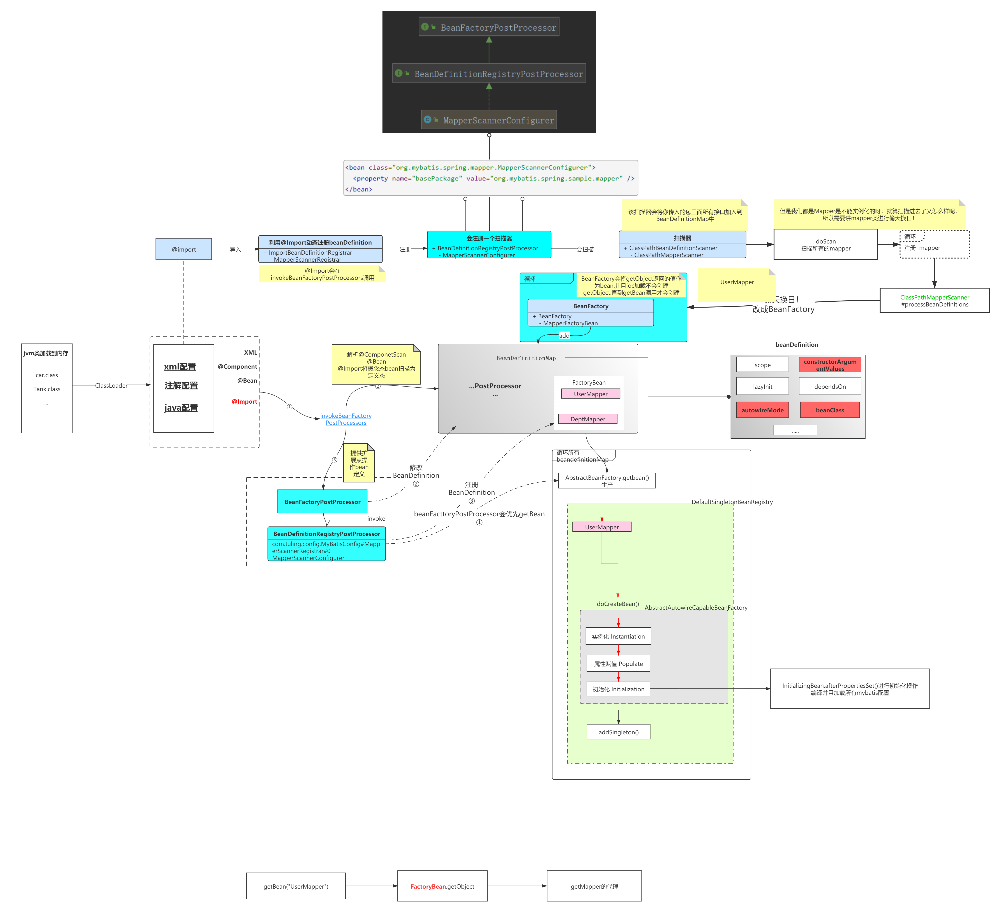

# handson-mybatis
基于spring手写mybatis，请对spring足够熟悉

# 手写原理
1. 首先MyBatis的Mapper接口核心是JDK动态代理
2. Spring会排除接口,无法注册到IOC容器中
3. MyBatis 实现了BeanDefinitionRegistryPostProcessor 可以动态注册BeanDefinition
4. 需要自定义扫描器（继承Spring内部扫描器ClassPathBeanDefinitionScanner）重写排除接口的方法,支持扫描出接口
5. 但是接口虽然注册成了BeanDefinition但是无法实例化Bean因为接口无法实例化
6. 需要将BeanDefinition的BeanClass替换成JDK动态代理的实例(偷天换日)
7. Mybatis通过FactoryBean的工厂方法设计模式可以自由控制Bean的实例化过程，可以在getObject方法中创建JDK动态代理



# 为什么选择FactoryBean
要想使用@AutoWired注入xxxMapper代理对象，Spring容器中必须要存在才行, 那么Spring是怎么把不同的Mapper代理对象作为一个bean放入容器中呢？

回顾下，把Bean交给spring容器的方式有哪些？
1. xml 声明bean `<bean id="", class="">`
2. @ConponentScan + @Sevice/@Controller/@Repository/@Componet
3. @Import(XXX.class)
4. ImportSelector 接口 -> 返回类名数组
5. ImportBeanDefinitionRegistrar 接口 -> registerBeanDefinitions，程序员可以利用某些机制去修改BeanDefinition，实现扩展
   上面这五种方法bean的创建过程是交给spring负责的，流程如下
```java
类路径(class) 
-> bean definition 
-> 根据BeanDefinition中的class信息反射生成bean实例 
-> put in cache
```

但是mapper不是一个普通的类，它是个接口并没有实现类，因此无法用传统方式创建。mapper的背后是代理类在起作用，那么把代理对象交给spring容器的方式有哪些？

下面这三种方法可以通过Java动态代理Proxy.newInstance创建代理，再把代理对象交给Spring容器，完全由程序员控制

1. factoryBean
2. SingletonBeanRegistry.registerSingleton();方式可以，但是mybatis源码没有采用
3. @Bean，但是存在一个问题，一个项目可能有上百个Mapper，难道每一个都要写一个@Bean生成代理类？这岂不是累死个人！！Spring绝对不是靠这种方式整合的！

mybatis源码采用了factoryBean方式，并结合动态代理创建代理对象：
```java
Proxy.newInstance(ClassLoader loader, Class<?>[] interfaces, InvocationHandler h)
```

# spring源码如何为我们实例化factoryBean

1. 通过&前缀拼接beanName获取factoryBean对象：Object bean = getBean(FACTORY_BEAN_PREFIX + beanName);

```java
	@Override
	public void preInstantiateSingletons() throws BeansException {
		if (logger.isTraceEnabled()) {
			logger.trace("Pre-instantiating singletons in " + this);
		}

		// Iterate over a copy to allow for init methods which in turn register new bean definitions.
		// While this may not be part of the regular factory bootstrap, it does otherwise work fine.
		List<String> beanNames = new ArrayList<>(this.beanDefinitionNames);

		// Trigger initialization of all non-lazy singleton beans...
		for (String beanName : beanNames) {
			RootBeanDefinition bd = getMergedLocalBeanDefinition(beanName);
			if (!bd.isAbstract() && bd.isSingleton() && !bd.isLazyInit()) {
				if (isFactoryBean(beanName)) {
					Object bean = getBean(FACTORY_BEAN_PREFIX + beanName);
					if (bean instanceof SmartFactoryBean<?> smartFactoryBean && smartFactoryBean.isEagerInit()) {
						getBean(beanName);
					}
				}
				else {
					getBean(beanName);
				}
			}
		}

		// Trigger post-initialization callback for all applicable beans...
		for (String beanName : beanNames) {
			Object singletonInstance = getSingleton(beanName);
			if (singletonInstance instanceof SmartInitializingSingleton smartSingleton) {
				StartupStep smartInitialize = this.getApplicationStartup().start("spring.beans.smart-initialize")
						.tag("beanName", beanName);
				smartSingleton.afterSingletonsInstantiated();
				smartInitialize.end();
			}
		}
	}
```
2. 通过factoryBean.getObject()获取jdk动态代理创建的代理对象

```java
private Object doGetObjectFromFactoryBean(FactoryBean<?> factory, String beanName) throws BeanCreationException {
   Object object;
   try {
      object = factory.getObject();
   }
   catch (FactoryBeanNotInitializedException ex) {
      throw new BeanCurrentlyInCreationException(beanName, ex.toString());
   }
   catch (Throwable ex) {
      throw new BeanCreationException(beanName, "FactoryBean threw exception on object creation", ex);
   }

   // Do not accept a null value for a FactoryBean that's not fully
   // initialized yet: Many FactoryBeans just return null then.
   if (object == null) {
      if (isSingletonCurrentlyInCreation(beanName)) {
         throw new BeanCurrentlyInCreationException(
                 beanName, "FactoryBean which is currently in creation returned null from getObject");
      }
      object = new NullBean();
   }
   return object;
}
```

# 注意事项
注意事项，jdk动态代理要求InvocationHandler中持有的target引用一定是targetClass接口的实现类
```java
Proxy：

@CallerSensitive
public static Object newProxyInstance(ClassLoader loader,
                                      Class<?>[] interfaces,
                                      InvocationHandler h)
```
以满足invoke方法中反射执行的时候不会报错，否则java.lang.IllegalArgumentException: object is not an instance of declaring class
```java
InvocationHandler:

public Object invoke(Object proxy, Method method, Object[] args) throws Throwable {
    System.out.println("proxy:"+proxy.getClass().getName());
    // TODO 一些其他的处理
    return method.invoke(target, args);
}
```

但是mybatis原理中无此要求，因为mybatis利用动态代理最后并没有执行method.invoke(target, args);

mybatis只是利用了method.getAnnotation(TulingSelect.class);获取接口方法注解中的sql脚本


